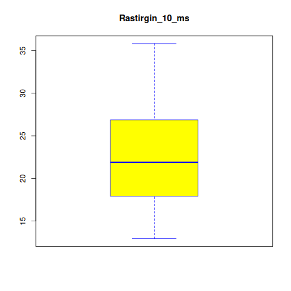
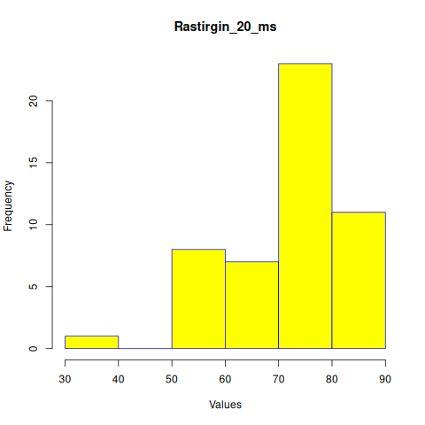
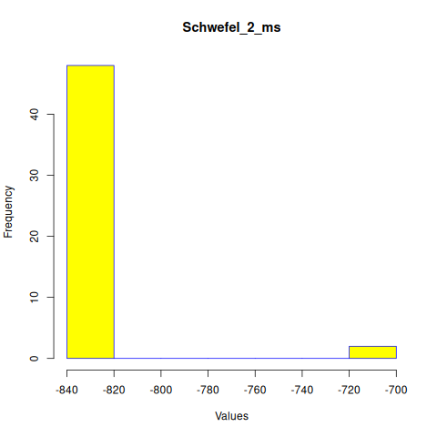
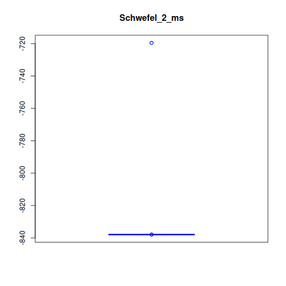
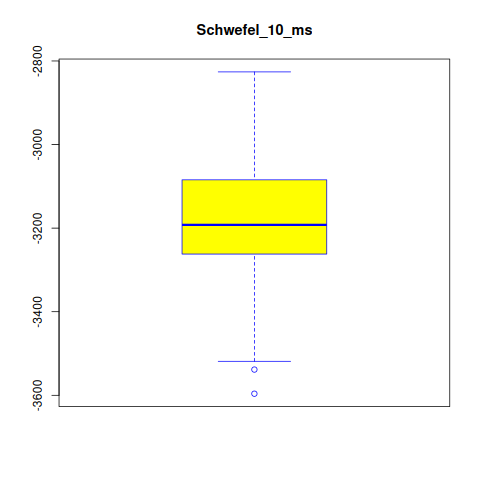
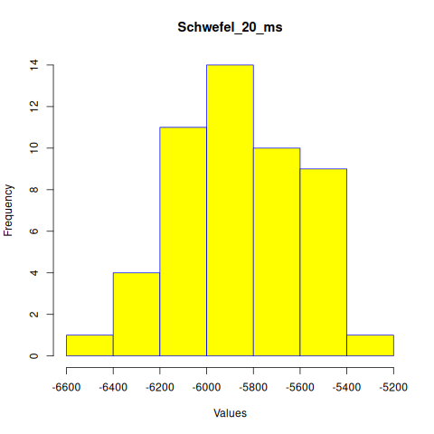
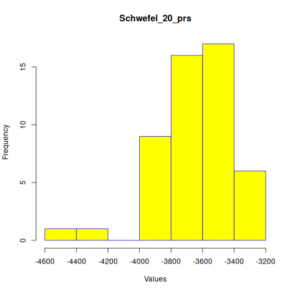

# Projekt zaliczeniowy - Algorytmy minimalizacji stochastycznej
Projekt polega na prostym opracowaniu statystycznym wyników porównania działania wybranych algorytmów minimalizacji stochastycznej.

Do porównania wybraliśmy poniższe algorytmy:
- **Poszukiwanie przypadkowe (Pure Random Search, PRS)**
- **Metoda wielokrotnego startu (multi-start, MS)**

oraz następujące funkcję do zminimalizowania:
- Funkcja Rastrigina
- Funkcja Schwefela

runs: 50 
points: 100 

Rastringin funtion:


dimensions: 2:
```
ms_mean: 0.3581853
ms_sd: 0.482429
ms_confidence: 0.2244652 0.4919053
```


```
prs_mean: 5.517673
prs_sd: 2.774727
prs_confidence: 5.424103 5.611243
```


```
difference: 5.159488
```

dimensions: 10 

```
ms_mean: 22.42633
ms_sd: 5.732205
ms_confidence: 20.83747 24.01519
```


```
prs_mean: 107.0787
prs_sd: 12.35098
prs_confidence: 106.901 107.2565
```


```
difference: 84.65242
```
dimensions: 20

```
ms_mean: 68.11467
ms_sd: 10.74648
ms_confidence: 65.13595 71.09338
```


```
prs_mean: 258.4285
prs_sd: 18.22583
prs_confidence: 258.245 258.612
```


```
difference: 190.3138
```
Schwefel funtion:

dimensions: 2 
```
ms_mean: -837.9658
ms_sd: 2.564049e-11
ms_confidence: -837.9658 -837.9658
```


```
prs_mean: -666.7806
prs_sd: 92.15418
prs_confidence: -670.3414 -663.2199
```


```
difference: 171.1851
```

dimensions: 10
```
ms_mean: -3250.155
ms_sd: 121.6811
ms_confidence: -3283.883 -3216.427
```


```
prs_mean: -1524.522
prs_sd: 253.0961
prs_confidence: -1528.622 -1520.423
```


```
difference: 1725.633
```
dimensions: 20 
```
ms_mean: -5936.533
ms_sd: 263.9994
ms_confidence: -6009.708 -5863.357
```


```
prs_mean: -2165.64
prs_sd: 364.192
prs_confidence: -2169.762 -2161.518
```


```
difference: 3770.893
```
