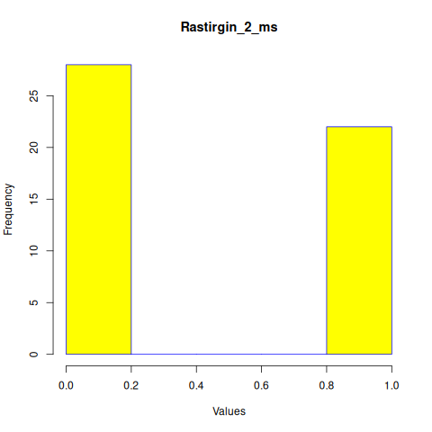
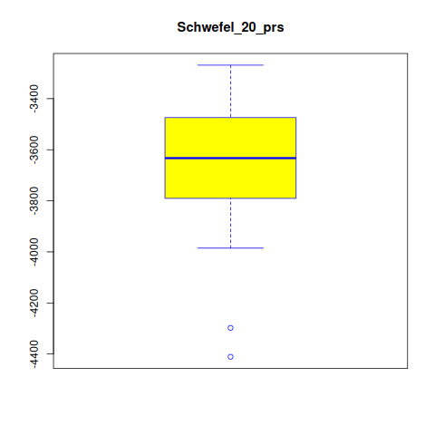

# Projekt zaliczeniowy - Algorytmy minimalizacji stochastycznej
Projekt polega na prostym opracowaniu statystycznym wyników porównania działania wybranych algorytmów minimalizacji stochastycznej.

Do porównania wybraliśmy poniższe algorytmy:
- **Poszukiwanie przypadkowe (Pure Random Search, PRS)**
- **Metoda wielokrotnego startu (multi-start, MS)**

oraz następujące funkcję do zminimalizowania:
- Funkcja Rastrigina
- Funkcja Schwefela

runs: 50

points: 100 

**Rastringin funtion:**


dimensions: 2:
```
ms_mean: 0.4178828
```



```
prs_mean: 5.498859
```


```
difference: 5.080976
confidence: 4.912705 5.249248
```

dimensions: 10 

```
ms_mean: 23.32179
```


```
prs_mean: 106.9339
```


```
difference: 83.61207
confidence: 81.92589 85.29825
```
dimensions: 20

```
ms_mean: 66.08496
```


```
prs_mean: 258.4253
```


```
difference: 192.3404
confidence: 189.1007 195.58
```
**Schwefel funtion:**

dimensions: 2 
```
ms_mean: -837.9658
```


```
prs_mean: -667.2426
```


```
difference: 170.7232
confidence: 167.2121 174.2343
```

dimensions: 10
```
ms_mean: -3256.301
```


```
prs_mean: -1526.062
```


```
difference: 1730.239
confidence: 1678.16 1782.318
```
dimensions: 20 
```
ms_mean: -5936.447
```


```
prs_mean: -2164.688
```


```
difference: 3771.759
confidence: 3696.311 3847.206
```
