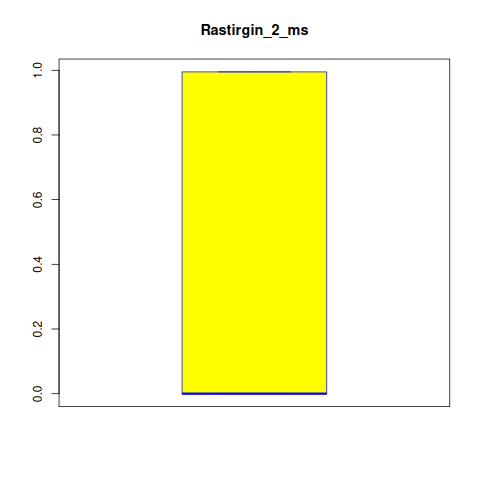
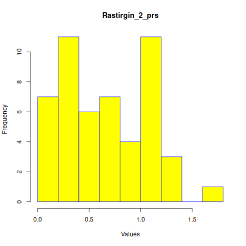
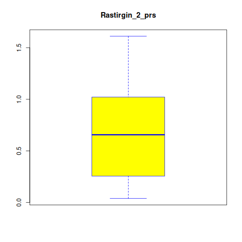
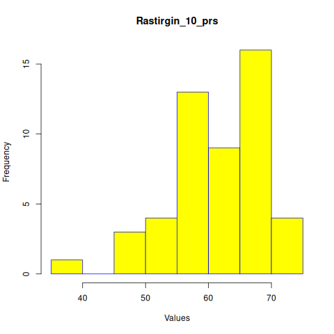
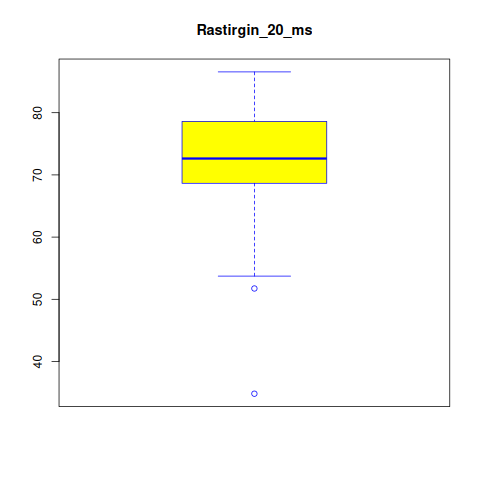
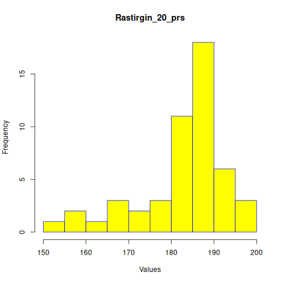
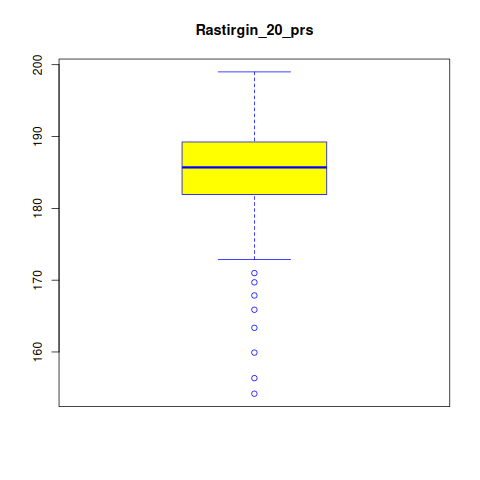
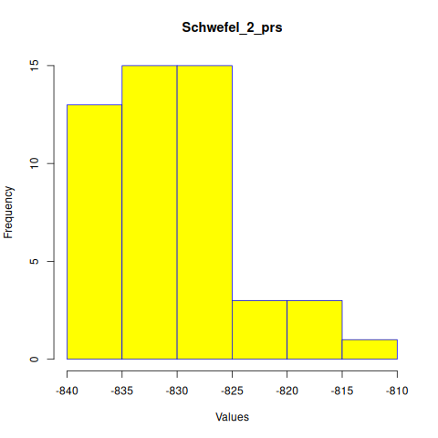
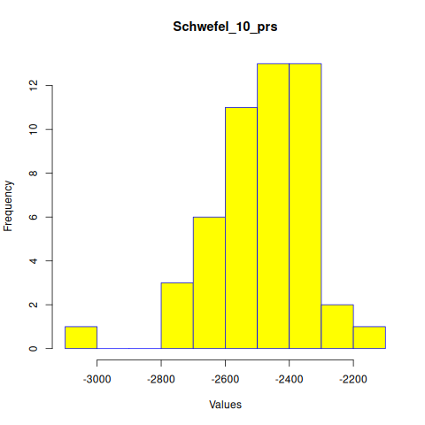
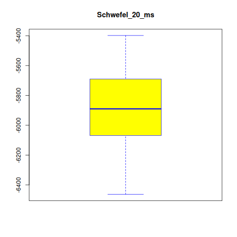

# Projekt zaliczeniowy - Algorytmy minimalizacji stochastycznej
### Autorzy: Jan Augustyn, Jakub Kroczek

Projekt polega na prostym opracowaniu statystycznym wyników porównania działania wybranych algorytmów minimalizacji stochastycznej.

Do porównania wybraliśmy poniższe algorytmy:
- **Poszukiwanie przypadkowe (Pure Random Search, PRS)**
- **Metoda wielokrotnego startu (multi-start, MS)**

oraz następujące funkcję do zminimalizowania:
- **Funkcja Rastrigina**
- **Funkcja Schwefela**

&nbsp;
&nbsp;

### Dla algorytmu MS:
**runs: 50**

**points: 100**

## Rastringin funtion:

&nbsp;


&nbsp;

### dimensions: 2
```
ms_mean: 0.437782
```


```
prs_mean: 0.6539188
```


```
difference: 0.2161368 
confidence: 0.03516352 0.39711
```

### dimensions: 10 

```
ms_mean: 22.52582
```


```
prs_mean: 61.54062
```


```
difference: 39.01479 
confidence: 36.45654 41.57305
```
### dimensions: 20

```
ms_mean: 71.7761
```


```
prs_mean: 183.2742
```


```
difference: 111.4981 
confidence: 107.3833 115.6128
```

&nbsp;
## Schwefel funtion:
&nbsp;


&nbsp;

### dimensions: 2 
```
ms_mean: -833.2282
```


```
prs_mean: -830.4457
```


```
difference: 2.782536 
confidence: -4.069524 9.634595
```

### dimensions: 10
```
ms_mean: -3198.905
```


```
prs_mean: -2482.101
```


```
difference: 716.8049 
confidence: 655.591 778.0188
```
### dimensions: 20 
```
ms_mean: -5871.349
```


```
prs_mean: -3651.144
```


```
difference: 2220.205 
confidence: 2123.456 2316.954
```
